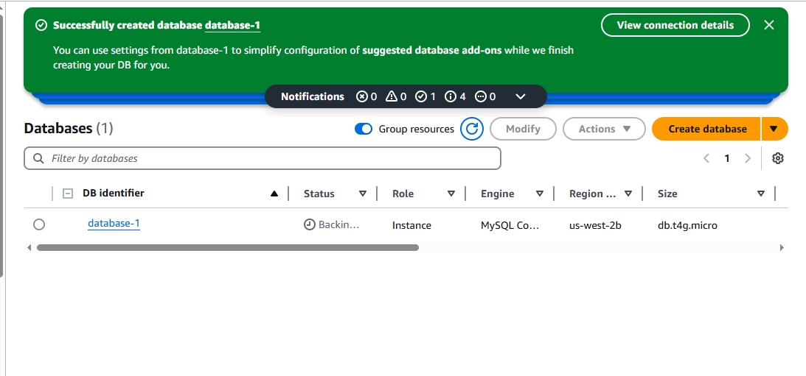

# Using Amazon RDS to Build and Interact with a Database Server (MySQL)

## Project Description
This project demonstrates how to provision a relational database using Amazon RDS with the MySQL engine and interact with it through an EC2-based Linux server. It covers creating a database, writing SQL commands to manage data, and performing SQL joins, giving a real-world feel of how cloud databases are set up and used.

###  What Was Used
* Amazon RDS (MySQL) – to host the database

* Amazon EC2 (LinuxServer) – to securely connect to the database

* MySQL Client – to run SQL commands from the EC2 instance

* VPC + Security Groups – to ensure secure network communication

### Launched a MySQL RDS Instance

### Connected to LinuxServer and Installed MySQL (EC2)

### Created and Populated the Tables

## Conclusion
In this project, I successfully hosted a static website on Amazon S3, providing a simple yet effective way to share content online. 

## Key Learnings 💡
*S3 Website Hosting* : Amazon S3 is a powerful and easy-to-use tool for hosting static websites. With its simple file upload and permission settings, it’s an excellent choice for anyone looking to host personal or professional content.

*File Structure and Permissions*: Understanding how S3 handles public access and file organization is crucial for ensuring the website functions correctly.

*Debugging*: Using full S3 URLs for images and testing the website via a browser made it easier to debug path-related issues.