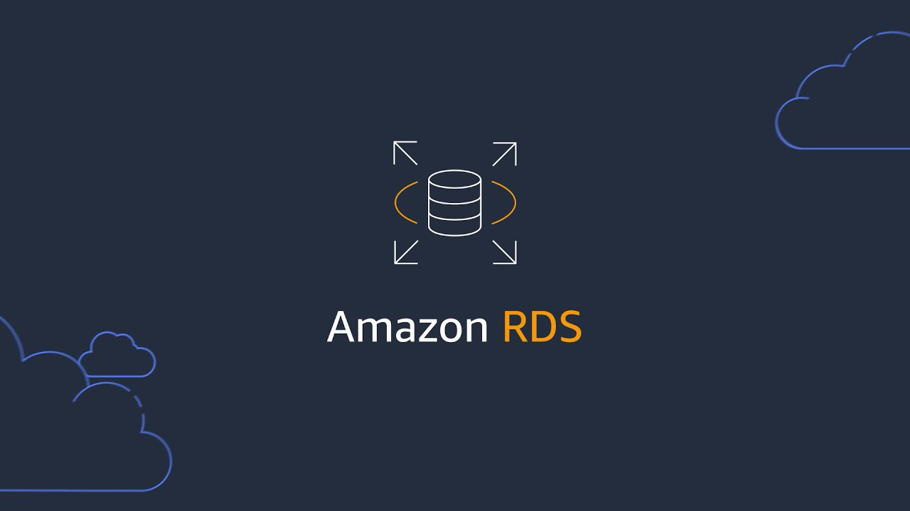
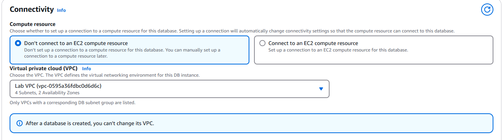
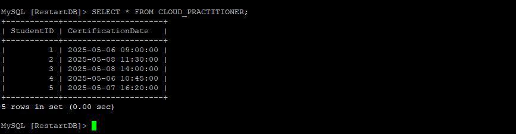
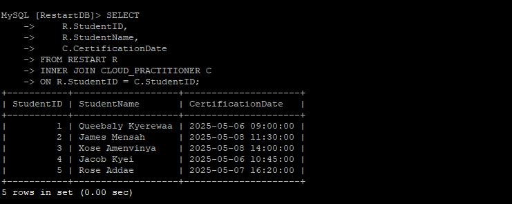

# Using Amazon RDS to Build and Interact with a Database Server (MySQL)

## Project Description
This project demonstrates how to provision a relational database using Amazon RDS with the MySQL engine and interact with it through an EC2-based Linux server. It covers creating a database, writing SQL commands to manage data, and performing SQL joins, giving a real-world feel of how cloud databases are set up and used.

###  What Was Used
* Amazon RDS (MySQL) – to host the database

* Amazon EC2 (LinuxServer) – to securely connect to the database

* MySQL Client – to run SQL commands from the EC2 instance

* VPC + Security Groups – to ensure secure network communication

### Launched a MySQL RDS Instance

### Connected to LinuxServer and Installed MySQL

### Created and Populated the Tables

## Troubleshooting Connection Issue
During the process, I encountered a connection issue which was resolved by updating the security group attached to the RDS instance. I added an inbound rule to allow traffic on port 3306 from the EC2 instance's IP address within the same VPC. This enabled secure communication between the EC2 instance and the RDS server.

## Conclusion
This project demonstrated how to set up and interact with an Amazon RDS database using the MySQL engine. I successfully connected to the database from a Linux EC2 instance using the MySQL client, created two tables, inserted sample data, and performed SQL queries including an inner join.

This project highlights foundational skills in working with managed relational databases in AWS.

