# Hosting a Static Website in Amazon S3

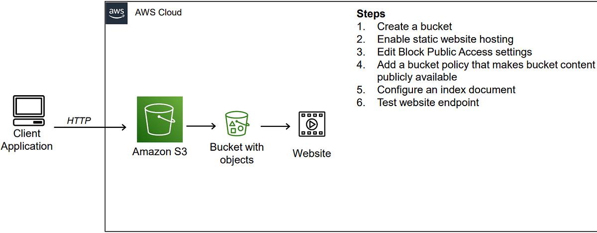

## Project Description
This project demonstrates how to set up a simple static website using Amazon S3 (Simple Storage Service). The goal is to showcase the basic use of AWS services, including S3 for web hosting and making a website publicly accessible.

### Set up an S3 Bucket

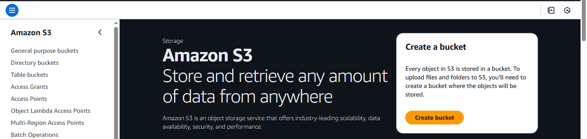 

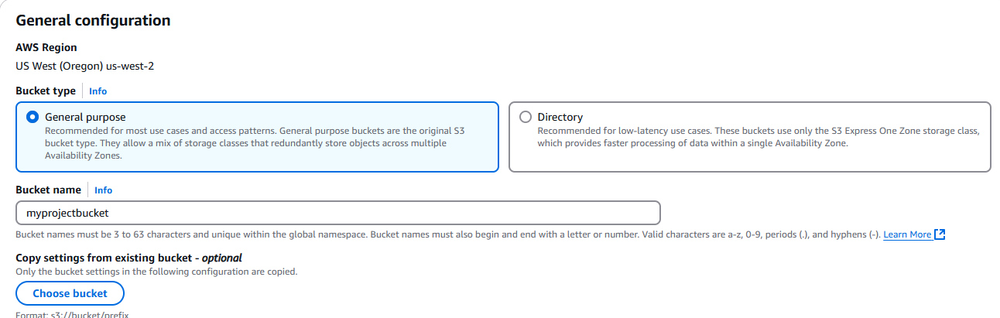 

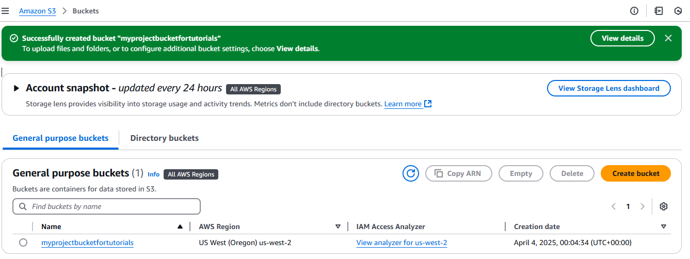 

### Upload Your Website Files
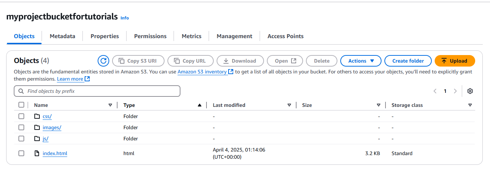

### Enable Static Website Hosting
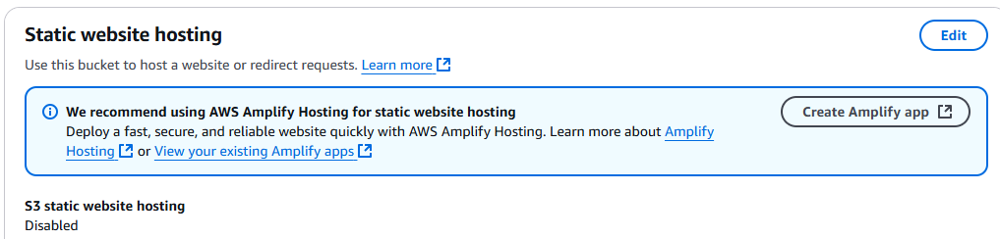
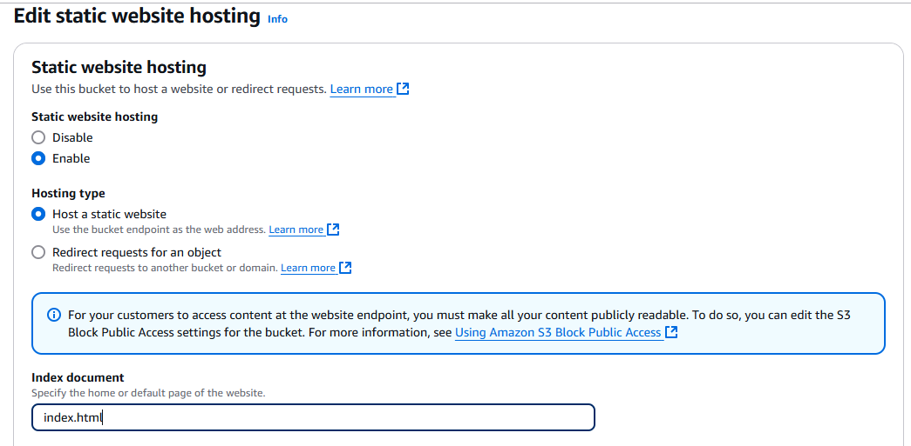

### Set Bucket Policy for Public Access
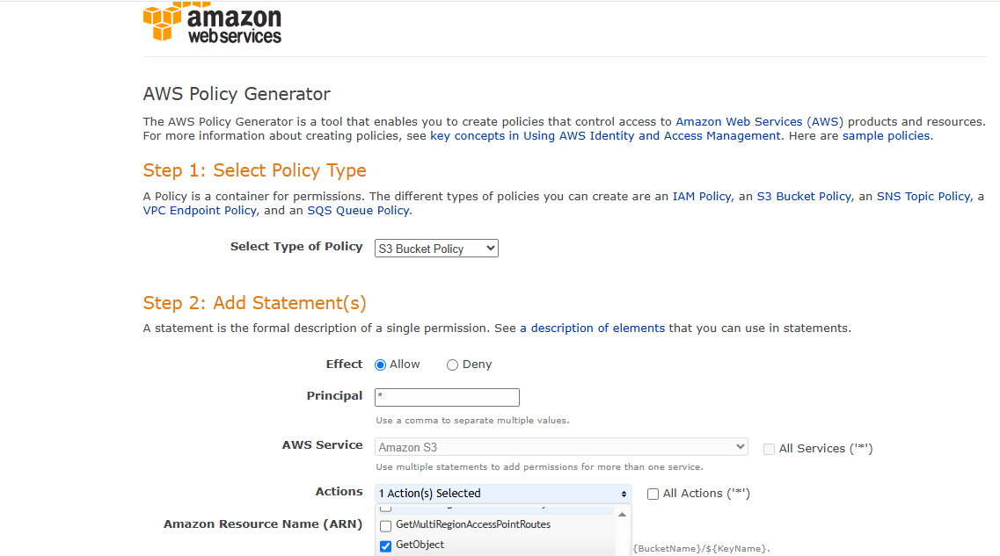
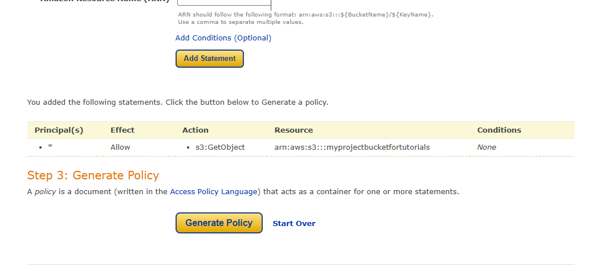
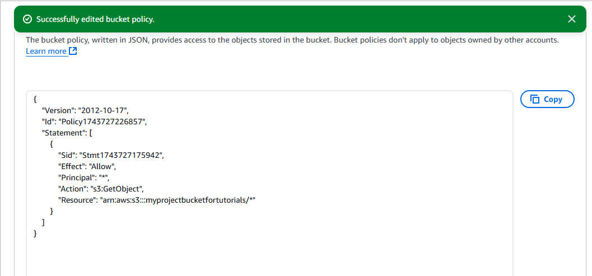

### Access Your Static Website
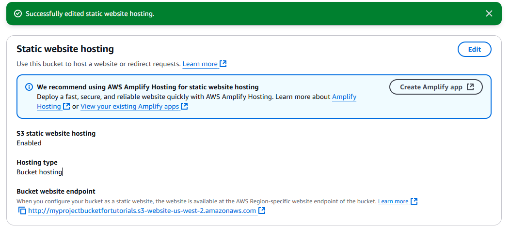
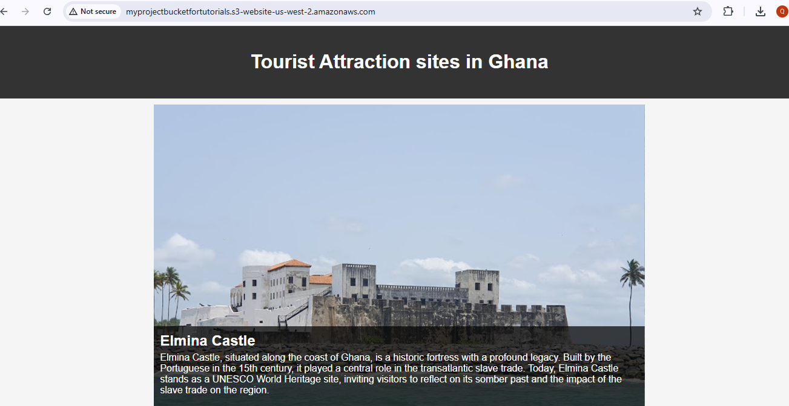

## Conclusion
In this project, I successfully hosted a static website on Amazon S3, providing a simple yet effective way to share content online. 

## Key Learnings 💡
*S3 Website Hosting* : Amazon S3 is a powerful and easy-to-use tool for hosting static websites. With its simple file upload and permission settings, it’s an excellent choice for anyone looking to host personal or professional content.

*File Structure and Permissions*: Understanding how S3 handles public access and file organization is crucial for ensuring the website functions correctly.

*Debugging*: Using full S3 URLs for images and testing the website via a browser made it easier to debug path-related issues.