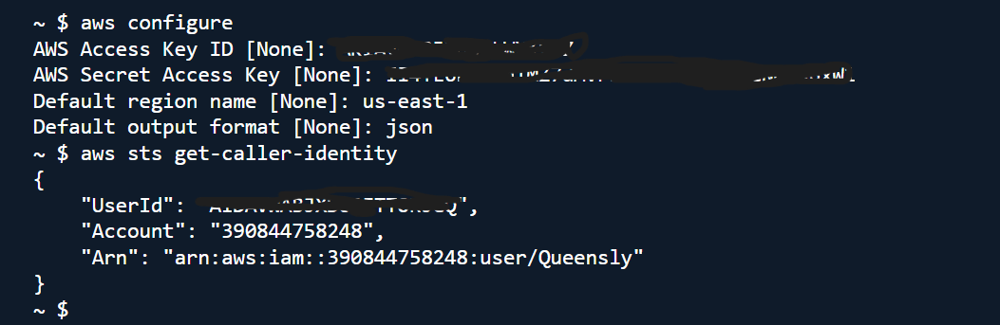
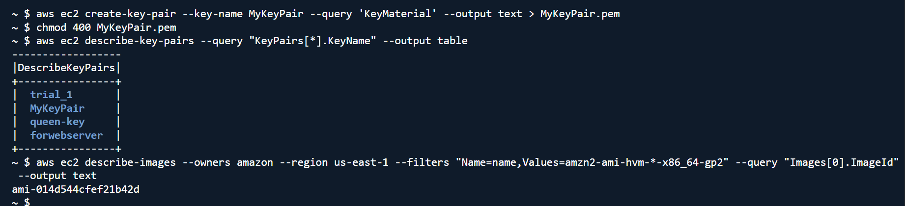
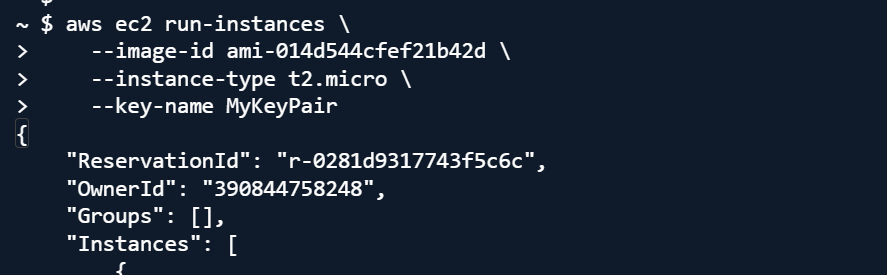
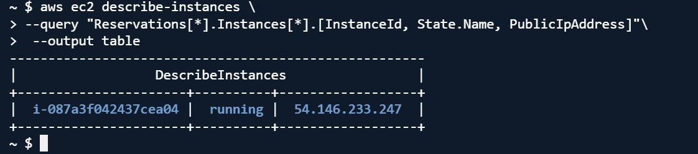
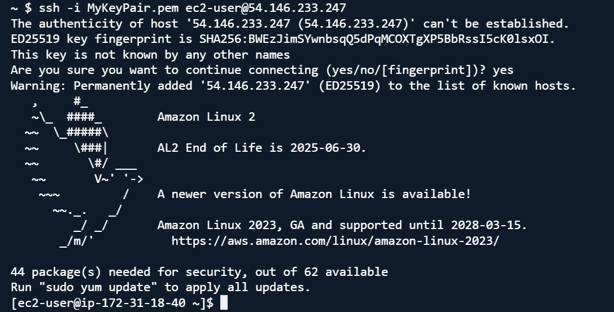
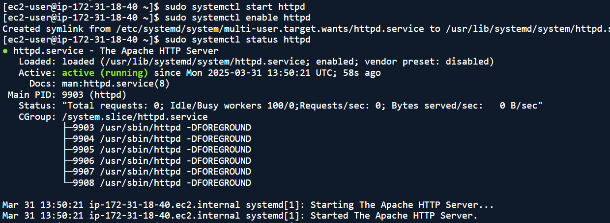
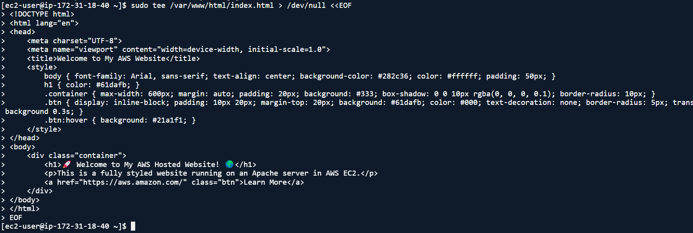
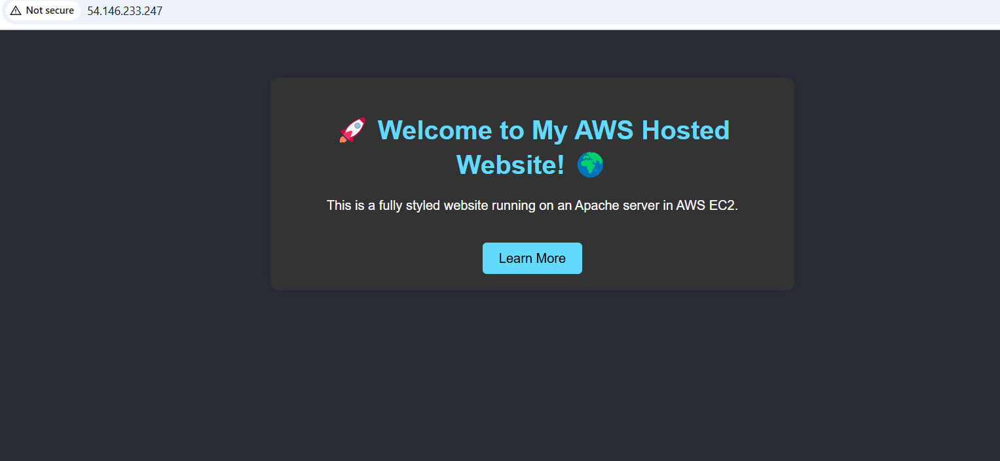
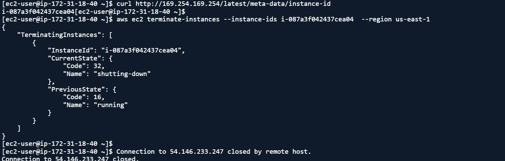
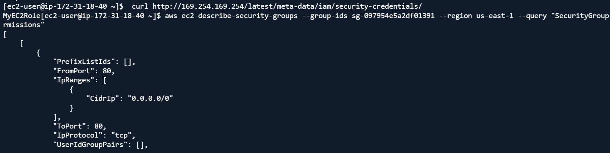

# Using the AWS CLI to Host A Website on Amazon EC2

## 📌 Project Description

In this project, I used the AWS Command Line Interface (CLI) to launch and configure an Amazon EC2 instance to host a simple static website. This hands-on project highlights how to manage cloud resources using commands instead of the AWS Management Console.

## 🧰 Tools & Services Used
Amazon EC2

AWS CLI

Amazon Linux 2

Apache HTTP Server

SSH

## Configure AWS CLI

## Launch an Instance 

 ## Connect to EC2 Using SSH

## Install Apache Web Server

## Deploy Web Content

## Access the Website

# Terminate Instance

## 🧯 Troubleshooting

Opened HTTP port 80 in the security group:

## ✅ Conclusion
This project helped me understand how to work with the AWS CLI to provision and configure resources without using the AWS Console. I gained confidence in launching and managing EC2 instances, installing software, and securely hosting web content from the terminal.